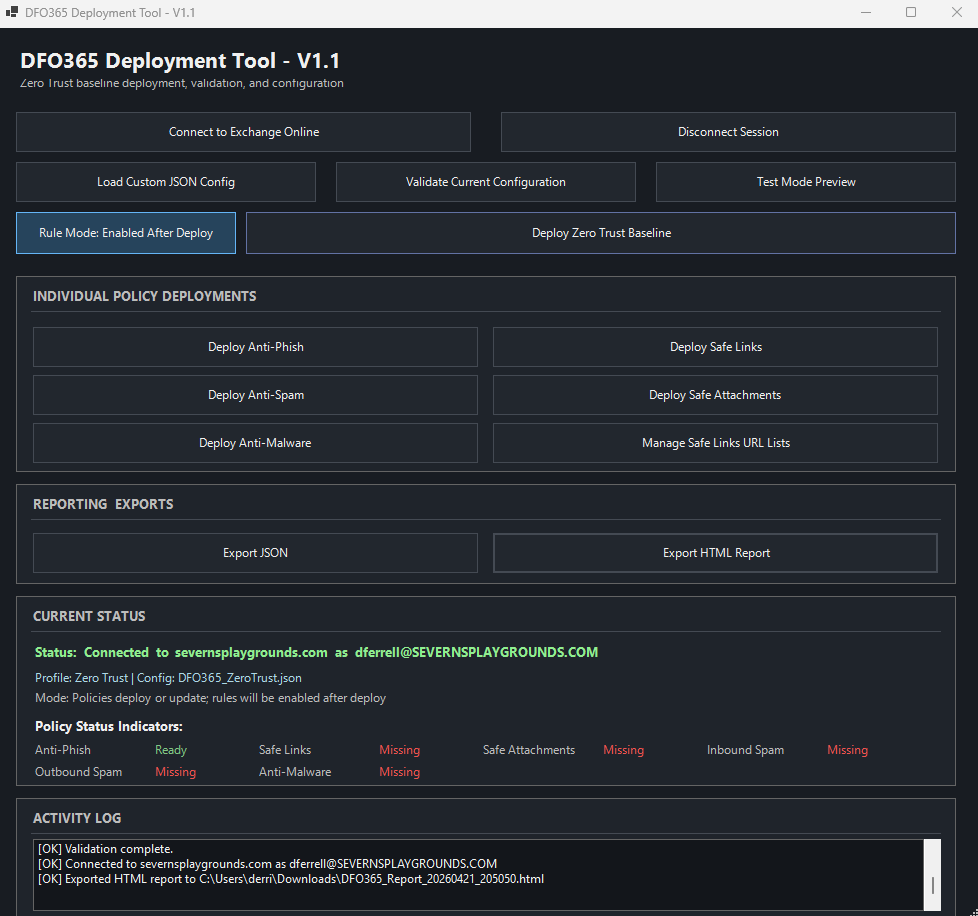

# 🛡️ DFO365 Deployment Tool

A Windows PowerShell deployment tool for configuring a Zero Trust baseline in Microsoft Defender for Office 365, with JSON-driven configuration, policy status indicators, test mode, validation, and built-in HTML/JSON reporting.

> **V1.1 is the current stable release** and includes UI-based deployment, validation, test mode, service enablement, and HTML reporting.

## Why This Tool Exists

Microsoft Defender for Office 365 deployments often require repeated manual configuration across multiple policy areas. This tool provides a repeatable, operator-friendly way to deploy, validate, and report on a Zero Trust-aligned baseline from a single interface.

## Interface Preview



---

[](YOUR-REPO-URL/blob/main/scripts/DFO365_V1_1_FINAL_enable_services.ps1)
[](YOUR-REPO-URL)
[](YOUR-REPO-URL)
[](YOUR-REPO-URL/blob/main/config/DFO365_ZeroTrust_FINAL.json)
[](YOUR-REPO-URL)
[](YOUR-REPO-URL)
[](YOUR-REPO-URL/releases)
[](YOUR-REPO-URL/releases)
[](YOUR-REPO-URL/blob/main/LICENSE)

---

# 📑 Table of Contents

📌 Current Version

🎯 Purpose

🆕 What's New in V1.1

⚠️ Important Behavior

🧱 Project Structure

⚙️ Requirements

🔐 Permissions Required

🚀 Quick Start

🖥️ UI Overview

🧪 Deployment Workflow

🧪 Test Mode

✅ Validation

📤 Export & Reporting

🧠 Design Principles

🔄 Versioning

🚧 Roadmap

💬 Notes

📌 Disclaimer

⭐ Summary

🙌 Contributions

📌 Current Version

V1.1.0 — Stable Release

This version introduces a fully interactive deployment UI, JSON-driven configuration, validation, reporting, and operational controls.


### 4. Add a “Key Features” section
This reads better than scattered mentions.

## Key Features

- Zero Trust baseline deployment for Defender for Office 365
- JSON-driven configuration
- Built-in validation and test mode
- Policy status indicators in the UI
- Enable/disable services directly from the interface
- JSON and HTML export
- Safe re-run behavior (idempotent deployment)

# 🎯 Purpose

The DFO365 Deployment Tool simplifies and standardizes the deployment of:

Anti-Phishing (P2)
Anti-Spam (Inbound & Outbound)
Safe Links
Safe Attachments
Anti-Malware

All aligned to a Zero Trust baseline.

🆕 What's New in V1.1
✅ Full WinForms GUI
✅ JSON-driven configuration
✅ Policy Status Indicators (real-time)
✅ Test Mode (Preview changes before deploy)
✅ Enable Services Toggle (live enforcement control)
✅ HTML Reporting directly from UI
✅ Improved deployment reliability & error handling
⚠️ Important Behavior
Policies are created or updated
Rules are deployed and can be:
Disabled (default safe mode)
Enabled via Enable Services toggle
No impact to mail flow during initial deployment
Safe to run multiple times (idempotent)

#🧱 Project Structure
repo/
├── scripts/
│   └── DFO365_V1_1.ps1
│
├── config/
│   └── DFO365_ZeroTrust.json
│
├── tests/
│   ├── smoke-test-checklist.md
│   └── validation-scenarios.md

# ⚙️ Requirements
PowerShell 5.1 or later
ExchangeOnlineManagement module

Install module:

```Powershell
Install-Module ExchangeOnlineManagement -Scope CurrentUser -Force -AllowClobber
```

# 🔐 Permissions Required

Global Administrator
or
Security Administrator

## Quick Start

```powershell
Install-Module ExchangeOnlineManagement -Scope CurrentUser -Force -AllowClobber
.\scripts\DFO365_V1_1_FINAL_enable_services.ps1
```

Then:

Click Connect to Exchange Online
Load config (auto-loads by default)
Deploy or validate

# 🖥️ UI Overview

The UI includes:

🔌 Connection Panel
🚀 Deploy Zero Trust Baseline
🧩 Individual Policy Deployment Buttons
🧪 Test Mode Preview
🔄 Enable Services Toggle
📊 Policy Status Indicators
📄 HTML / JSON Export
📜 Activity Log

# 🧪 Deployment Workflow
Launch tool
Connect to tenant
(Optional) Run Test Mode
Click Deploy Zero Trust Baseline
(Optional) Enable services via toggle
Validate deployment
Export report

# 🧪 Test Mode

Test Mode allows you to:

Preview changes before deployment
Identify missing policies/rules
Understand impact safely

Output includes:

“Would create”
“Would update”
“Would enable/disable”

# ✅ Validation
🔹 Built-in Validation (UI)
Policy existence
Rule existence
Rule state
🔹 Manual Testing

Location:

tests/smoke-test-checklist.md
🔹 Advanced Scenarios
tests/validation-scenarios.md

Includes:

Phishing simulation
Safe Links testing
Safe Attachments testing
Spam filtering
Malware (EICAR)

# 📤 Export & Reporting
From UI:
Export JSON
Export HTML Report
HTML Report Includes:
Tenant + account info
All policies and rules
Full configuration snapshot
🧠 Design Principles
Idempotent deployment
Safe-by-default
Visual operational feedback
Minimal tenant impact
JSON-driven flexibility
Operator-friendly UI

# 🔄 Versioning
Version	Description
V1.0.0	Baseline deployment tool
V1.1.0	UI, validation, reporting, JSON config, test mode
V2 (Planned)	Multi-profile + advanced configuration engine

# 🚧 Roadmap

V1.2
Risk scoring view
Policy drift detection
Export improvements

V2
Multiple config profiles (Zero Trust, Standard, Audit)
Full config vs tenant comparison
Enhanced UI (tabs / grouping)

# 💬 Notes
Some Exchange rules may default to enabled
Tool explicitly controls final state
Status indicators reflect real-time state

# 📌 Disclaimer

This tool is provided as-is for deployment acceleration and standardization.

Always validate in a test tenant before production use.

# ⭐ Summary

DFO365 Deployment Tool V1.1 delivers:

Secure baseline deployment
Real-time visibility
Safe testing capability
Operational control via UI
Built-in reporting

# 🙌 Contributions

Feedback, improvements, and ideas are welcome.

## 🔥 Tip

For best results:

Keep JSON in /config
Run script from /scripts
Test before enabling services in production

---

## V1.1 Release Highlights

- Dark-themed WinForms UI
- Zero Trust JSON configuration model
- Policy status indicators
- Test mode preview
- Enable Services control
- HTML reporting from the UI
- Improved connection and config handling

---

## Tested With

- Windows PowerShell 5.1 & 7
- ExchangeOnlineManagement module
- Microsoft Defender for Office 365 policy deployment workflows
